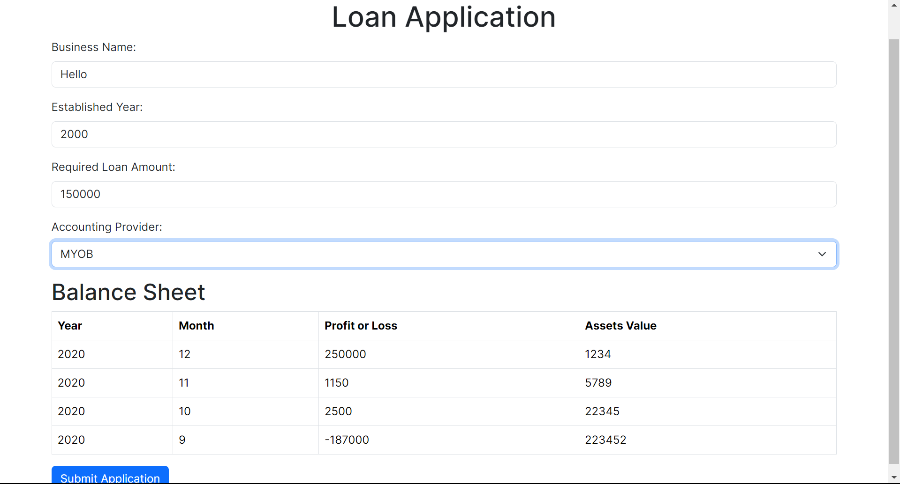

# loan-app

## Tech stack

- Backend : Python + Django
- Frontend : Typescript + Next.js
- Frontend will call REST API's from backend.

## CI

- CI for linting & testing backend code using Github Actions is available.

## How to run?

### Backend

- `cd backend`
- Create a virtualenv if it doesn't exist `python -m venv venv`
- Activate virtualenv `source venv/bin/activate`
- Install requirements `pip install -r requirements_dev.txt`
- Start the server `python manage.py runserver`
- Backend will be available at 'localhost:8000'

### Frontend
- `cd frontend`
- `npm install`
- `npm run dev`
- Access frontend at http://localhost:3000
- UI will look like this. 

## Directory structure

- backend/loan_app contains all backend logic related to the app.
